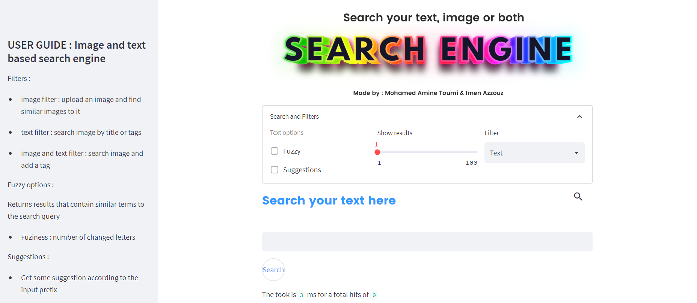
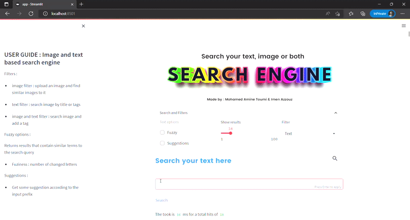
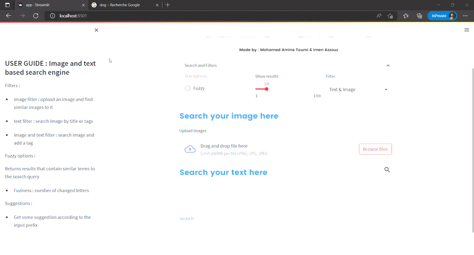

<h1 align="center">
   
  Content and Text Based Image Retrieval Search Engine
</h1>

  <h4>
    <a href="#context">Context</a> |
     <a href="#types-of-search">Types of Search</a> |
    <a href="#pipeline">Pipeline</a> |
    <a href="#used-technologies">Used technologies</a> |
    <a href="#contribution">Contribution</a>
  </h4>

 

## Context
An image search engine that covers over 2 million annotated images from [Open Images Dataset](https://storage.googleapis.com/openimages/web/index.html). This search engine enables its users to search using text, images or a combination of both.

## Types of Search
There are 3 types of queries : 
### Text query : 
Search images by title or tags

Example : Text query : "moon"

### Image query : 
Upload an image and find its similar images

Example : Image query : Brown dog

### Image & Text query : 
Search images based on the combination of uploaded image and text

Example : Image query : White car + Text query : "red"

## Used technologies
For the indexing :
- ElasticSearch 7.14.1
- Elastiknn plugin 7.14.1.0   `elasticsearch-plugin install https://github.com/alexklibisz/elastiknn/releases/tag/7.14.1.0 `

For the web application : 
- ElasticSearch python client: to query elasticsearch index.
- FastAPI : to develop an API to enable querying from the web application.
- Streamlit : to design a frontend for the application where users perform text and image search.

## Contribution

